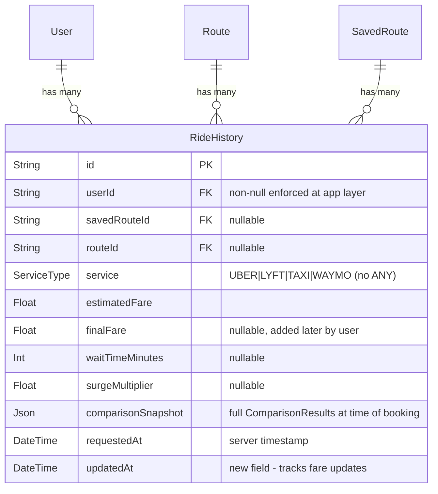

# feat: Ride History Tracking

## Overview

Add a complete ride history tracking system that lets users log rides they've taken from comparison results, view their ride history with estimated vs actual fare comparisons, and see spending analytics. The `RideHistory` Prisma model already exists but has zero implementation — no API routes, no database functions, no UI.

## Problem Statement / Motivation

Users compare ride prices but have no way to track which rides they actually took or how accurate the estimates were. This data is valuable for:

- **Users**: See spending patterns, verify estimate accuracy, identify which service saves them the most money over time
- **Product**: Understand booking behavior, improve pricing model confidence scores, measure platform value (total savings facilitated)
- **Retention**: Users who track rides have a reason to return to the app beyond one-off comparisons

## Proposed Solution

Build the full ride history stack in three phases:

1. **Data layer** — Database module, schema migration (indexes), types, validation
2. **API layer** — CRUD endpoints for ride history (GET list, POST create, PATCH update fare, DELETE)
3. **UI layer** — "I took this ride" button in comparison results + standalone `/history` page with analytics

## Technical Approach

### Architecture

```
┌─────────────────────────────────┐
│  Comparison Results Component   │
│  "I took this ride" button      │
│  (auth-gated, blocking POST)   │
└──────────────┬──────────────────┘
               │
               ▼
┌─────────────────────────────────┐
│  POST /api/ride-history         │  ← Create entry
│  GET  /api/ride-history         │  ← List + analytics
│  PATCH /api/ride-history/[id]   │  ← Update finalFare
│  DELETE /api/ride-history/[id]  │  ← Delete entry
└──────────────┬──────────────────┘
               │
               ▼
┌─────────────────────────────────┐
│  lib/database-ride-history.ts   │
│  (barrel-exported via           │
│   lib/database.ts)              │
└──────────────┬──────────────────┘
               │
               ▼
┌─────────────────────────────────┐
│  Prisma: RideHistory model      │
│  + new indexes via migration    │
└─────────────────────────────────┘
```



### Key Design Decisions

1. **IDOR protection via implicit ownership**: PATCH and DELETE use `prisma.rideHistory.findFirst({ where: { id, userId } })` — if no match, return 404 (not 403, to avoid leaking existence). Follows the safest pattern without a separate ownership check function.

2. **`ServiceType.ANY` rejected on POST**: A logged ride must be a specific service. The Zod schema uses `z.enum(['uber', 'lyft', 'taxi', 'waymo'])` — consistent with existing `ServiceTypeSchema` in `lib/validation.ts`.

3. **`comparisonSnapshot` stores full `ComparisonResults`**: All services' prices at booking time are preserved. This enables "savings vs alternatives" analytics without additional joins. Size capped at 64KB via Zod refinement.

4. **POST is blocking (not fire-and-forget)**: User clicks "I took this ride" and expects confirmation. The API returns `{ id }` on success. This differs from the passive `persistComparison()` pattern.

5. **Cursor-based pagination**: GET returns up to 20 records per page, ordered by `requestedAt DESC`, with a cursor for the next page. Follows Prisma's idiomatic cursor pattern.

6. **Standalone `/history` page**: Not a dashboard tab — the dashboard is already ~480 lines. The history page gets its own route with back-navigation to dashboard.

7. **`updatedAt` added to schema**: Tracks when `finalFare` was patched in. Added via non-destructive migration alongside the index.

### Implementation Phases

#### Phase 1: Data Layer

**Files to create/modify:**

- `prisma/schema.prisma` — Add `updatedAt`, add `@@index([userId, requestedAt])`
- `prisma/migrations/YYYYMMDD_add_ride_history_indexes/` — New migration
- `types/index.ts` — Add `RideHistoryEntry`, `RideHistoryListResponse`, `RideHistoryStats`
- `lib/database-ride-history.ts` — New module with all DB functions
- `lib/database.ts` — Add barrel export block

**Schema changes (`prisma/schema.prisma`):**

```prisma
model RideHistory {
  id                 String       @id @default(cuid())
  user               User?        @relation(fields: [userId], references: [id])
  userId             String?
  savedRoute         SavedRoute?  @relation(fields: [savedRouteId], references: [id])
  savedRouteId       String?
  route              Route?       @relation(fields: [routeId], references: [id])
  routeId            String?
  service            ServiceType
  estimatedFare      Float
  finalFare          Float?
  waitTimeMinutes    Int?
  surgeMultiplier    Float?
  comparisonSnapshot Json
  requestedAt        DateTime     @default(now())
  updatedAt          DateTime     @updatedAt  // NEW

  @@index([userId, requestedAt])              // NEW
}
```

**New types (`types/index.ts`):**

```typescript
export interface RideHistoryEntry {
  id: string
  routeId: string | null
  service: ServiceType
  estimatedFare: number
  finalFare: number | null
  waitTimeMinutes: number | null
  surgeMultiplier: number | null
  comparisonSnapshot: ComparisonResults
  requestedAt: string
  updatedAt: string
  pickupAddress?: string
  destinationAddress?: string
}

export interface RideHistoryListResponse {
  history: RideHistoryEntry[]
  nextCursor: string | null
  total: number
}

export interface RideHistoryStats {
  totalSpent: number
  rideCount: number
  avgFare: number
  byService: Partial<Record<ServiceType, { count: number; totalSpent: number; avgFare: number }>>
  totalSavings: number
}
```

**Database module (`lib/database-ride-history.ts`):**

```typescript
// Functions to implement:
export async function createRideHistory(
  data: CreateRideHistoryInput
): Promise<{ id: string } | null>
export async function getRideHistoryForUser(
  userId: string,
  cursor?: string,
  limit?: number
): Promise<RideHistoryListResponse>
export async function getRideHistoryStats(
  userId: string,
  daysBack?: number
): Promise<RideHistoryStats>
export async function updateRideHistoryFare(
  id: string,
  userId: string,
  finalFare: number
): Promise<RideHistoryEntry | null>
export async function deleteRideHistory(id: string, userId: string): Promise<boolean>
```

**Note on `getRideHistoryForUser`**: Must `include: { route: { select: { pickup_address: true, destination_address: true } } }` to populate `pickupAddress`/`destinationAddress` on `RideHistoryEntry`. The `total` count should only be fetched on the first page (when `cursor` is undefined) to avoid an extra query on subsequent pages.

**Patterns to follow:**

- Guard with `isDatabaseAvailable()` — return empty/null when DB unavailable
- Wrap in try/catch with `reportPersistenceError()`
- Import `prisma` from `@/lib/prisma`
- Use `mapServiceToEnum()` for service conversion
- Immutable patterns — no mutation

**Success criteria:**

- [ ] Migration applies cleanly
- [ ] All 5 DB functions implemented with proper error handling
- [ ] Barrel export updated in `lib/database.ts`
- [ ] Types added to `types/index.ts`
- [ ] Unit tests for all DB functions (mock Prisma)

#### Phase 2: API Layer

**Files to create:**

- `app/api/ride-history/route.ts` — GET (list) + POST (create)
- `app/api/ride-history/[id]/route.ts` — PATCH (update fare) + DELETE

**POST `/api/ride-history` — Log a ride:**

```typescript
// Zod schema
const CreateRideHistorySchema = z.object({
  routeId: z.string().min(1).optional(),
  savedRouteId: z.string().min(1).optional(),
  service: z.enum(['uber', 'lyft', 'taxi', 'waymo']),
  estimatedFare: z.number().positive().max(1000),
  waitTimeMinutes: z.number().int().min(0).max(180).optional(),
  surgeMultiplier: z.number().min(1).max(10).optional(),
  comparisonSnapshot: z
    .record(z.unknown())
    .refine(val => JSON.stringify(val).length <= 65536, 'Comparison snapshot too large'),
})
```

- Auth required (401 if not logged in)
- Validate with Zod `safeParse`
- Call `createRideHistory()` — blocking, returns `{ id }` or `null`
- Check `if (!result)` → return 500 with error (matches `createPriceAlert` pattern)
- On success, return `{ id }` with status 201
- Wrap with `withCors(withRateLimit(handler))`
- Export `OPTIONS = withCors(handlePost)` for CORS preflight (matches existing pattern)

**GET `/api/ride-history` — List history + optional analytics:**

```
GET /api/ride-history?cursor=abc&limit=20           → paginated list
GET /api/ride-history?analytics=true&daysBack=30    → spending stats
```

- Auth required
- Returns `RideHistoryListResponse` or `RideHistoryStats` based on query params

**PATCH `/api/ride-history/[id]` — Update actual fare:**

```typescript
const UpdateFareSchema = z.object({
  finalFare: z.number().positive().max(1000),
})
```

- Auth required
- IDOR: query `{ where: { id, userId } }` — return 404 if not found
- Returns updated entry

**DELETE `/api/ride-history/[id]` — Delete entry:**

- Auth required
- IDOR: query `{ where: { id, userId } }` — return 404 if not found
- Hard delete, return 204

**Note**: Both route files must export `OPTIONS` handlers for CORS preflight. The `[id]` dynamic route segment is a new pattern — no existing API route uses it. This is standard Next.js App Router but worth noting for implementers looking for a local example.

**Success criteria:**

- [ ] All 4 endpoints implemented following existing patterns
- [ ] Auth checks on every endpoint
- [ ] IDOR protection on PATCH and DELETE
- [ ] Zod validation on POST and PATCH
- [ ] `getRequestId` + `createResponseHeaders` on all responses
- [ ] `logError` in catch blocks
- [ ] Integration tests for all endpoints

#### Phase 3: UI Layer

**Files to create/modify:**

- `components/ride-comparison-results.tsx` — Add "I took this ride" button per service card
- `app/history/page.tsx` — New standalone page (~400 lines)

**Comparison Results — "I took this ride" button:**

```
[Uber $24.50]  [Book] [I took this ride]
[Lyft $22.00]  [Book] [I took this ride]
```

- Auth-gated: if not logged in, show auth dialog
- Blocking POST to `/api/ride-history`
- On success: `toast.success('Ride logged!')` + disable button (show "Logged")
- On failure: `toast.error('Failed to log ride')`
- Pass `routeId`, `service`, `estimatedFare` (parsed from price string), `surgeMultiplier`, `comparisonSnapshot` (full results)

**History Page (`app/history/page.tsx`):**

Layout:

```
┌─────────────────────────────────────────┐
│  ← Back to Dashboard                   │
│                                         │
│  RIDE HISTORY                           │
│  Track your rides and spending          │
│                                         │
│  ┌─────────────┐  ┌─────────────┐      │
│  │ Total Spent │  │ Rides Taken │      │
│  │   $342.50   │  │     18      │      │
│  └─────────────┘  └─────────────┘      │
│  ┌─────────────┐  ┌─────────────┐      │
│  │ Avg Fare    │  │ Saved       │      │
│  │   $19.03    │  │   $47.20    │      │
│  └─────────────┘  └─────────────┘      │
│                                         │
│  ┌─ Ride Card ────────────────────────┐ │
│  │ Uber  •  Mar 21, 2026  2:30 PM    │ │
│  │ SFO → Downtown SF                  │ │
│  │ Est: $24.50    Actual: [Add fare]  │ │
│  │ 1.2x surge  •  4 min wait         │ │
│  │                          [Delete]  │ │
│  └────────────────────────────────────┘ │
│                                         │
│  [Load more]                            │
└─────────────────────────────────────────┘
```

- `'use client'` with auth guard (redirect to `/` if not logged in)
- Two data fetches: `?analytics=true` for stats cards + paginated list
- Per-card: inline "Add actual fare" input (PATCH on submit)
- Delete with inline confirmation ("Are you sure?" secondary button, not a modal)
- Empty state: icon + "No rides logged yet" + CTA link to home page
- Loading state: spinner matching dashboard pattern
- Error state: error message with retry button matching dashboard pattern
- Back navigation link to `/dashboard` (required since global nav is hidden on non-home routes)

**Success criteria:**

- [ ] "I took this ride" button in comparison results
- [ ] History page with stats cards and ride list
- [ ] Inline fare update working
- [ ] Delete with confirmation working
- [ ] Empty, loading, and error states
- [ ] Back navigation present
- [ ] E2E test for the full flow

## System-Wide Impact

### Interaction Graph

```
User clicks "I took this ride"
  → RideComparisonResults.handleLogRide()
    → POST /api/ride-history
      → createRideHistory() [lib/database-ride-history.ts]
        → prisma.rideHistory.create()
  → toast.success() on resolve

User navigates to /history
  → GET /api/ride-history
    → getRideHistoryForUser() [lib/database-ride-history.ts]
      → prisma.rideHistory.findMany({ where: { userId }, cursor, take })
  → GET /api/ride-history?analytics=true
    → getRideHistoryStats() [lib/database-ride-history.ts]
      → prisma.rideHistory.aggregate() + groupBy()
```

### Error Propagation

DB functions **never throw** — they catch internally and return fallback values. This matches the established pattern in `database-logging.ts` and `database-routes.ts`.

- **DB unavailable**: `isDatabaseAvailable()` returns false → DB functions return fallback (`null`, `[]`, `false`) → API handles gracefully
- **Prisma query failure (reads)**: caught in DB function → `reportPersistenceError()` logs → returns `[]` or empty stats → API returns empty data → UI shows empty state (not error)
- **Prisma query failure (writes)**: caught in DB function → `reportPersistenceError()` logs → returns `null` or `false` → API checks return value → returns 500 with error message → UI shows toast error
- **Validation failure**: caught at API layer by Zod → 400 with field-level errors → UI shows toast error
- **Auth failure**: 401 → UI redirects to auth dialog or home
- **Unexpected API error**: caught by route-level `catch` block → `logError()` → 500 → UI shows error with retry

**Pattern reference**: `createPriceAlert()` returns `null` on failure, and the price-alerts route checks `if (!alert)` to return 400. Follow this same pattern for `createRideHistory()`.

### State Lifecycle Risks

- **Partial failure on create**: Single `prisma.rideHistory.create()` — atomic, no risk
- **Orphaned records**: If a `Route` or `SavedRoute` is deleted, `RideHistory` records with those FKs become orphaned but still valid (nullable FKs by design). Route name falls back to "Unknown route" in UI.
- **Double-click duplication**: No unique constraint prevents duplicates. Mitigated by disabling the button after first click in UI. Acceptable for MVP — dedup can be added later.

### API Surface Parity

- **Dashboard savings panel** (`app/api/dashboard/route.ts`): Already shows `comparisonCount` and `totalSavings` from recommendations. Ride history analytics are additive — they show actual spending, not estimated savings. No overlap conflict.
- **Search logs** (`SearchLog` model): Tracks comparisons performed. Ride history tracks rides taken. Complementary, not overlapping.

## Acceptance Criteria

### Functional Requirements

- [ ] Authenticated users can log a ride from comparison results
- [ ] Authenticated users can view paginated ride history at `/history`
- [ ] Authenticated users can add/update the actual fare paid
- [ ] Authenticated users can delete ride history entries
- [ ] Analytics panel shows total spent, ride count, avg fare, savings vs alternatives, and per-service breakdown
- [ ] Unauthenticated users see auth dialog when attempting to log a ride
- [ ] Unauthenticated users are redirected to `/` when accessing `/history`

### Non-Functional Requirements

- [ ] IDOR protection: users can only access/modify/delete their own history
- [ ] Input validation: Zod schemas on POST and PATCH with bounds checking
- [ ] `comparisonSnapshot` size capped at 64KB
- [ ] Paginated queries use `@@index([userId, requestedAt])` index
- [ ] All API responses include `requestId` header
- [ ] All errors logged via `logError()` with route context
- [ ] No mutation — all state updates create new objects

### Quality Gates

- [ ] Unit tests for all 5 database functions
- [ ] Integration tests for all 4 API endpoints (auth, validation, IDOR, happy path)
- [ ] E2E test: compare rides → log ride → view in history → add fare → delete
- [ ] Files under 800 lines
- [ ] `npm run quality` passes

## Dependencies & Risks

| Risk                                           | Likelihood | Impact | Mitigation                                                                              |
| ---------------------------------------------- | ---------- | ------ | --------------------------------------------------------------------------------------- |
| Schema migration conflicts with other branches | Low        | Medium | Migration is additive (index + column) — no destructive changes                         |
| `comparisonSnapshot` bloats DB                 | Low        | Medium | 64KB Zod cap + periodic cleanup cron                                                    |
| Rate limiting blocks active users              | Medium     | Low    | Shared rate limiter is acceptable for MVP; separate limit can be added later            |
| Dashboard and history analytics confusion      | Low        | Low    | Clear labeling: dashboard = "savings from recommendations", history = "actual spending" |

## Alternative Approaches Considered

1. **Dashboard tab instead of standalone page** — Rejected because `dashboard/page.tsx` is already ~480 lines and mixing history list + analytics would push it well over 800 lines. Standalone page is cleaner.

2. **Fire-and-forget POST (like `persistComparison`)** — Rejected because the user explicitly clicks "I took this ride" and expects confirmation. Silent failure would erode trust.

3. **Offset pagination** — Rejected in favor of cursor-based. Offset pagination has known issues with concurrent inserts shifting page boundaries. Cursor is idiomatic for Prisma and more reliable.

4. **`userId NOT NULL` migration** — Deferred. Making `userId` non-nullable requires checking for existing null records and is a potentially breaking change. App-layer enforcement is sufficient for now.

## Sources & References

### Internal References

- API pattern: `app/api/dashboard/route.ts` (auth, IDOR, error handling)
- API pattern: `app/api/price-alerts/route.ts` (Zod validation, CRUD)
- Page pattern: `app/dashboard/page.tsx` (auth guard, data fetch, loading/error states)
- DB pattern: `lib/database-logging.ts` (isDatabaseAvailable, reportPersistenceError)
- DB barrel: `lib/database.ts` (export organization)
- Types: `types/index.ts` (ServiceType, ComparisonResults, RideResult)
- Service mapping: `lib/service-mappings.ts` (mapServiceToEnum)
- Comparison results UI: `components/ride-comparison-results.tsx` (auth-gated actions, toast feedback)
- IDOR protection: `app/api/dashboard/route.ts:13-33` (verifyRouteOwnership pattern)
